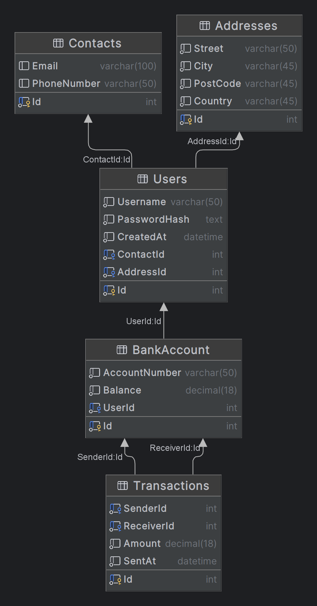

# BankWebApp

This is a banking web application developed using C#, JavaScript, and SQL.

## Project Structure

The project is structured into several parts:

- `env/Envs.cs`: Contains the connection string for the MSSQL database.
- `database.sql`: Contains the SQL scripts for creating the necessary tables and indices in the database.
- `wwwroot/`: Contains the static files for the web application. (js css images)
- 

## Setup

1. Clone the repository.
2. Ensure that you have docker installed.
2. Ensure that you have docker-compose installed.
3. Run `docker-compose up -d` to start the application.
5. Enjoy!.

## How to login to an admin account

1. Open the login page
2. Enter the following credentials:
   - Username: `admin`
   - Password: `admin`
3. Login.
4. Admin tools can be accessed by clicking the new buttons in the navbar.

## How to add admin access to a new user

1. Register a new user.
2. Open the database insert a new row into `UserRoles` table
3. Set the `UserId` to the `Id` of the user you want to make admin.
4. Set the `RoleName` to `Admin`.
5. Save the changes.
6. The user should now have admin access.
7. Admin tools can be accessed by clicking the new buttons in the navbar.

## Features

- User registration and login
- Bank account creation
- Transaction processing
- Transaction history
- Admin dashboard
- User dashboard

## Database Diagram

## Custom User Components

- `Navbar`: The navigation bar at the top of the page. made with View Component.
- `Footer`: The footer at the bottom of the page. made with Partial View.

## Documentation

The documentation for this project is available in the `docs` folder.
Files in the `docs` folder are generated using doxygen.

Available versions of the documentation:

- [PDF Documentation](./docs/documentation.pdf)&nbsp;&nbsp;&nbsp;&nbsp;(same as the rtf version)
- [RTF Documentation](./docs/rtf/refman.rtf)&nbsp;&nbsp;&nbsp;&nbsp;(same as the pdf version, may give warnings about being unsafe)
- [HTML Documentation](./docs/html/index.html)&nbsp;(best version, but requires a browser to view)
- Code Comments&nbsp;&nbsp;&nbsp;&nbsp;&nbsp;&nbsp;&nbsp;&nbsp;&nbsp;(in the source code)